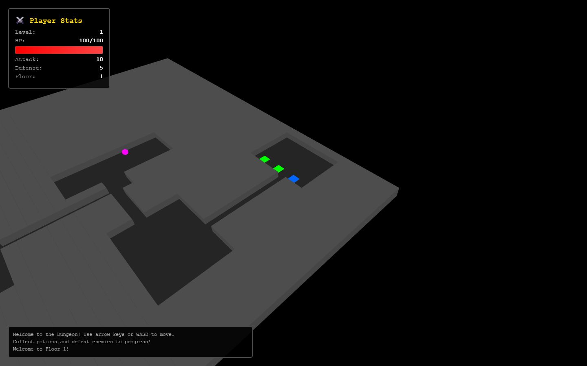
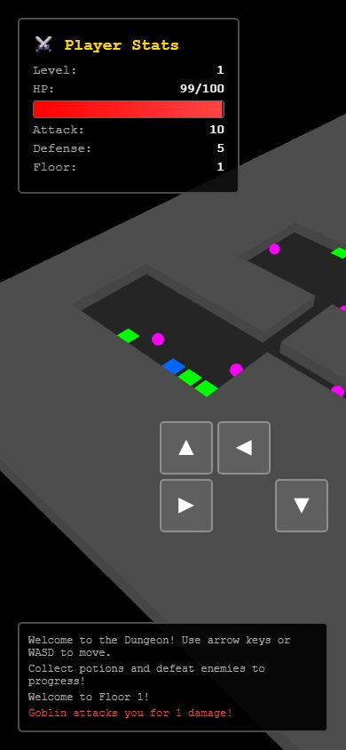

# Dungeon Crawler

Juego de mazmorras por turnos que corre en el navegador, hecho con TypeScript y Three.js. Los personajes son sprites 2D dentro de un espacio 3D. Es un proyecto de aprendizaje de desarrollo de videojuegos, pensado para que cualquiera pueda abrirlo y jugar unos minutos.





## Características

- Mazmorras generadas al azar con salas conectadas por pasillos.
- Combate por turnos: caminas hacia un enemigo para atacarlo.
- Experiencia y niveles que mejoran tus estadísticas.
- Pociones de vida que se recogen al pasar sobre ellas.
- Escaleras para bajar al siguiente piso.
- Controles con teclado (flechas o WASD) y botones táctiles para celular.
- Panel con nivel, vida, ataque, defensa y piso, más un registro de combate.

## Tecnologías

TypeScript, Three.js y Vite.

## Cómo correrlo

Requiere Node.js 18 o superior.

```bash
npm install
npm run dev
```

El juego abre en `http://localhost:3000`. Para generar la versión de producción usa `npm run build`.

## Estructura

- `src/core`: ciclo del juego y entrada de teclado y táctil.
- `src/entities`: jugador, enemigos e items.
- `src/world`: generación de la mazmorra y casillas.
- `src/combat`: cálculo del combate.
- `src/rendering`: escena, cámara y dibujo con Three.js.
- `src/ui`: panel de estadísticas y registro de combate.

Más detalle en `ARCHITECTURE.md` y `QUICKSTART.md`.

## Licencia

MIT.
